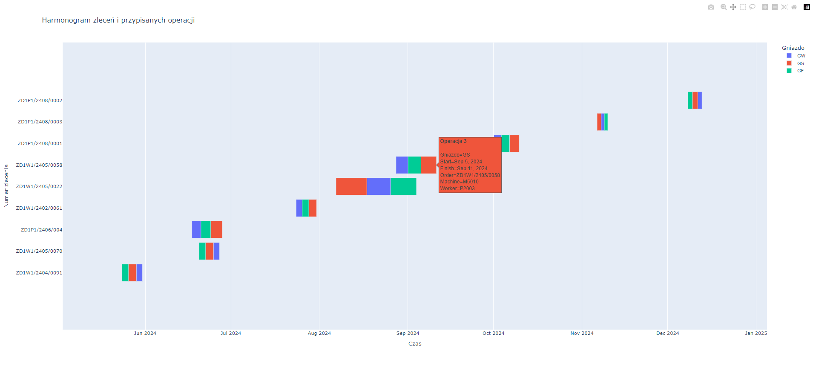

# Harmonogram przepływu zadań

## Opis Projektu

### Cel Projektu
Projekt ma na celu tworzenie wykresu Gantta, który wizualizuje harmonogram dla zleceń klienta. Głównym celem jest przedstawienie operacji w formie graficznej, gdzie oś Y reprezentuje zlecenia klienta, a oś X przedstawia czas realizacji. Projekt uwzględnia także przypisane maszyny i pracowników oraz dba o optymalne zarządzanie ich czasem pracy.

### Kluczowe Funkcje

#### Wizualizacja Harmonogramu Gantta:
* Wykres Gantta prezentuje zlecenia klienta na osi Y i czas na osi X. Każde zlecenie może mieć wiele operacji (marszrut).

#### Reprezentacja Maszyn i Gniazd:
* Na wykresie znajdują się różne rodzaje maszyn (gniazda), które są reprezentowane przez różne kolory. Każdy kolor odpowiada innemu typowi maszyny, co umożliwia łatwe rozróżnienie i analizę ich wykorzystania.

#### Przypisania do Operacji:
* Każde zlecenie składa się z wielu operacji, z których każda ma określony czas trwania oraz przypisanego pracownika i maszynę.

#### Zarządzanie Zasobami:
* Harmonogram dba o to, aby w tym samym czasie nie były używane te same maszyny i pracownicy do różnych zadań. Projekt zapewnia, że zasoby są przydzielane w sposób optymalny, unikając kolizji w ich wykorzystaniu.

### Szczegóły Techniczne

* Sortowanie Operacji: Operacje są sortowane rosnąco według ich ID, co pozwala na logiczne uporządkowanie zadań w ramach zlecenia.
* Obliczanie Czasu: Czas rozpoczęcia i zakończenia każdej operacji jest precyzyjnie obliczany, aby odzwierciedlić rzeczywisty przebieg zleceń. Wykres jest dostosowany tak, aby odzwierciedlał rzeczywisty czas trwania i kolejność operacji.
* Interaktywność: Wykres Gantta jest interaktywny, umożliwiając użytkownikom łatwe analizowanie poszczególnych zadań oraz szczegółów dotyczących przypisanych maszyn i pracowników.

### Użyte Technologie
* Python: Do obliczeń i generowania danych używany jest język Python.
* Pandas: Biblioteka Pandas służy do manipulacji i analizy danych.
* Plotly Express: Biblioteka Plotly Express jest wykorzystywana do tworzenia i wizualizacji wykresu Gantta.

### Obrazek poglądowy
